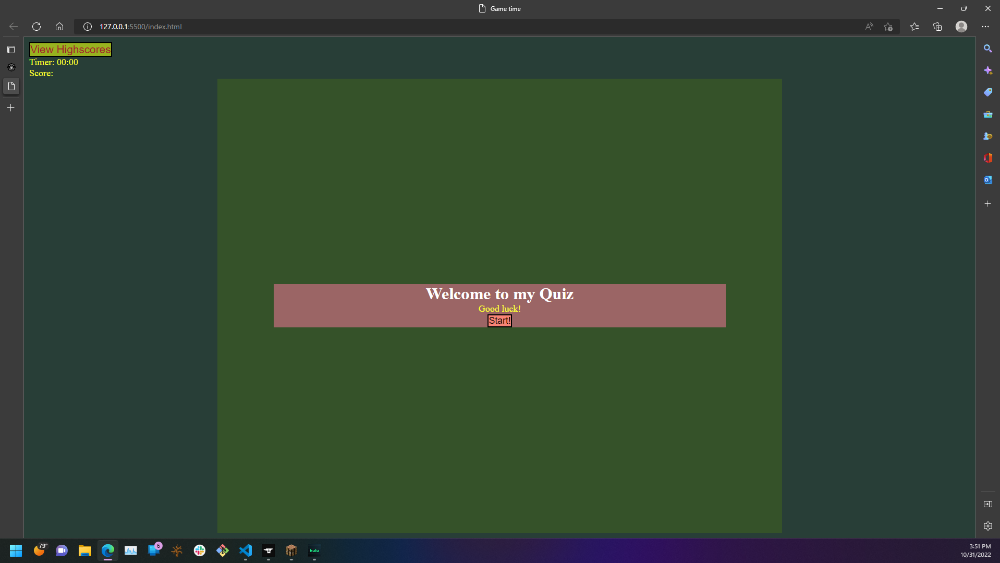

# Web-api-quiz

## User Story
```md
As a user that wants to learn code, i want to be able to practice my familiarization with the fundamentals of coding 
```

## Summary:
To allow users an easir way to to practice their fundamentals of coding in a fun and exicing way through a quiz.

## Screen Shot Demo


## Links:

link to the deployed page: https://davg1700.github.io/Web-api-quiz/

link to github page: https://github.com/Davg1700/Web-api-quiz
